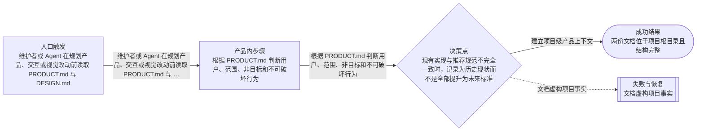

# 流程

## 主流程

- 维护者或 Agent 在规划产品、交互或视觉改动前读取 PRODUCT.md 与 DESIGN.md
- 根据 PRODUCT.md 判断用户、范围、非目标和不可破坏行为
- 根据 DESIGN.md 选择现有 token、组件和交互模式

## Mermaid 流程图

## 边界情况

- 现有实现与推荐规范不完全一致时，记录为历史现状而不是全部提升为未来标准
- 文章输出主题与插件 UI 使用不同视觉角色时保持边界
- Obsidian 主题变量与文档中的十六进制基准值同时存在时，以运行时主题变量优先

## 失败模式

- 文档虚构项目事实
- 把文章主题色误作插件状态色
- 文档增加未授权的产品范围或实现要求
- YAML 或固定章节结构不可被工具解析
