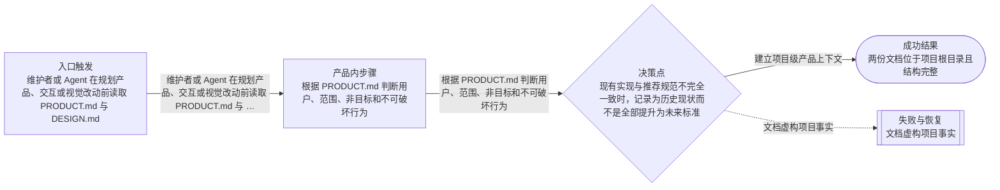
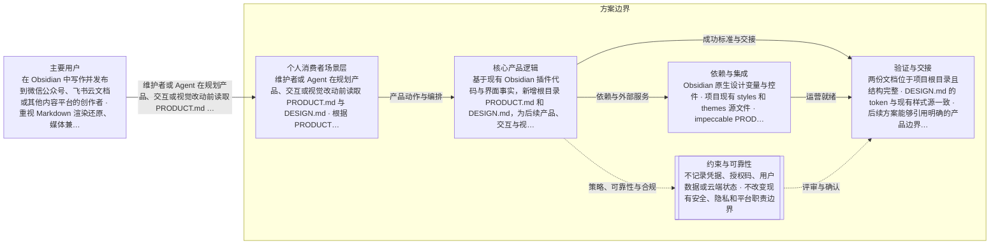

# 项目级产品与设计上下文文档
> 语言规则：用户可见说明、PRD、spec 和 tasks 跟随用户当前主语言；无法判断时才使用简体中文兜底。PRD、OpenPrd、OpenSpec、API、SDK、CLI、TypeScript、JSON、HTTP、WebSocket、字段 key、命令名、品牌名、产品名和协议名等必要专有名词保留原文。
- 版本: v0001
- 负责人: 项目维护者
- 产品场景: 面向个人消费者场景
- 场景模板: 面向个人消费者场景
- 状态: synthesized
- 生成时间: 2026-07-16 23:50:27
## 元信息

- 标题: 项目级产品与设计上下文文档
- 负责人: 项目维护者
- 状态: clarifying
- 版本: v0001
- 产品场景: 面向个人消费者场景
- 日期: 2026-07-16

## 问题

- 问题陈述: 基于现有 Obsidian 插件代码与界面事实，新增根目录 PRODUCT.md 和 DESIGN.md，为后续产品、交互与视觉调整提供统一且可复用的依据。
- 为什么是现在: 在继续规划自定义 CSS、高亮、飞书体验和跨仓库授权状态修复前，先建立稳定的产品与设计依据，减少后续方案冲突、遗漏和过度设计。
- 证据:
  - README 与 docs/basic 已描述目标用户、产品边界和核心发布流程
  - styles、themes 与 views 已形成可提取的颜色、字体、间距、圆角和组件模式
  - 现有浅色、深色、飞书与多平台截图可用于核对实际视觉语言

## 用户与相关方

- 主要用户:
  - 在 Obsidian 中写作并发布到微信公众号、飞书云文档或其他内容平台的创作者
  - 重视 Markdown 渲染还原、媒体兼容与多平台草稿工作流的技术写作者和内容运营者
- 次要用户:
  - 待补充
- 相关方:
  - 项目维护者
  - 后续参与产品、设计和代码修改的 Agent 或开发者
  - 依赖稳定预览与发布流程的现有用户

## 目标与成功标准

- 目标:
  - 建立项目级产品上下文
  - 建立项目级视觉与交互规范
  - 为后续修复规划提供不冲突、可验证的设计依据
- 成功指标:
  - 两份文档位于项目根目录且结构完整
  - DESIGN.md 的 token 与现有样式源一致
  - 后续方案能够引用明确的产品边界、视觉原则和可访问性约束
- 验收目标:
  - PRODUCT.md 覆盖用户、产品目的、品牌性格、反例、设计原则和可访问性
  - DESIGN.md 基于现有 styles、themes、views 与截图，包含标准 token frontmatter 和固定六章节
  - 明确区分 Obsidian 插件操作界面与文章输出主题
  - 最终只新增两份根目录文档且内容可由仓库事实追溯

## 验证与创业闭环

- 可触达社区:
  - 待补充
- 第一批种子用户:
  - 待补充
- 社区契合与触达依据:
  - 待补充
- 当前替代方案: 待补充
- 痛点与替代证据:
  - 待补充
- 手工交付路径:
  - 待补充
- 手工作战卡:
  - 待补充
- 承诺信号:
  - 待补充
- 首个低成本验证: 完成文档结构与事实一致性检查后，以两份文档为依据继续整理已确认的修复规划。
- 先活下来方案:
  - 待补充
- 付费验证信号:
  - 待补充
- 第一版只做一件事: 待补充
- 周末级验证: 待补充
- 最小工具桥接:
  - 待补充
- 产品化门槛:
  - 待补充
- 第一批客户路径:
  - 待补充
- 初始收费假设: 待补充
- 客户 1 盈利路径: 待补充
- 销售与增长纪律:
  - 待补充
- 可逆性判断: 待补充
- 客户真问题校验: 待补充
- 价值观一致性: 待补充

## 范围与非目标

- 范围内:
  - 新增根目录 PRODUCT.md
  - 新增根目录 DESIGN.md
  - 校验文档结构、设计 token 与仓库事实一致性
- 范围外:
  - 不修改实现代码
  - 不修改 AGENTS.md
  - 不创建额外设计配置或独立页面
  - 不修改凭据、业务参数或云端状态

## 场景与流程

- 主流程:
  - 维护者或 Agent 在规划产品、交互或视觉改动前读取 PRODUCT.md 与 DESIGN.md
  - 根据 PRODUCT.md 判断用户、范围、非目标和不可破坏行为
  - 根据 DESIGN.md 选择现有 token、组件和交互模式
- 边界情况:
  - 现有实现与推荐规范不完全一致时，记录为历史现状而不是全部提升为未来标准
  - 文章输出主题与插件 UI 使用不同视觉角色时保持边界
  - Obsidian 主题变量与文档中的十六进制基准值同时存在时，以运行时主题变量优先
- 失败模式:
  - 文档虚构项目事实
  - 把文章主题色误作插件状态色
  - 文档增加未授权的产品范围或实现要求
  - YAML 或固定章节结构不可被工具解析

## 可视化图表

### 产品流程

### 架构

## 需求

- 功能需求:
  - PRODUCT.md 使用 product register
  - DESIGN.md 遵循标准 YAML token frontmatter 与 Overview、Colors、Typography、Elevation、Components、Do's and Don'ts 六章节
  - 文档使用自然中文并保持结构清楚、美观、可扫描
- 非功能需求:
  - 自然中文
  - 结构清楚且可扫描
  - 内容可由仓库事实追溯
  - 不修改运行时行为
  - 避免重复规则和过度设计
- 业务规则:
  - 只新增 PRODUCT.md 和 DESIGN.md
  - 项目事实优先于通用模板
  - 运行时 Obsidian 主题变量优先于静态颜色基准
  - 插件 UI 与文章输出保持独立视觉边界

## 业务护栏

- 成本来源:
  - 待补充
- 额度与限制:
  - 待补充
- 滥用防护:
  - 待补充
- 监控信号:
  - 待补充
- 报警阈值:
  - 待补充
- 止损动作:
  - 待补充

## 约束、依赖与风险

- 技术约束:
  - 事实来源限于 README、AGENTS.md、docs/basic、styles、themes、views 与现有截图
  - 保留当前工作区既有未提交改动
  - 不把历史实现中的不一致全部提升为未来标准
- 合规要求:
  - 不记录凭据、授权码、用户数据或云端状态
  - 不改变现有安全、隐私和平台职责边界
- 依赖:
  - Obsidian 原生设计变量与控件
  - 项目现有 styles 和 themes 源文件
  - impeccable PRODUCT.md 与 DESIGN.md 结构规范
- 假设:
  - 仓库中的 README、docs/basic、样式源与截图代表当前产品事实
  - 项目默认设计 register 为 product
  - 中文是主要用户可见语言
- 风险:
  - 将历史视觉不一致写成强制标准
  - 文档过长导致实际开发难以使用
  - 插件 UI 与文章输出规范混淆
- 开放问题:
  - 当前无阻塞性开放问题

## 类型专项模块

- 类型: 个人消费者场景专项
- persona: 在 Obsidian 中完成内容创作，希望以较低排版与搬运成本稳定发布到微信、飞书及其他平台的个人创作者和技术写作者。
- segment: 以中文内容创作为主、重视技术内容还原与多平台草稿效率的 Obsidian 用户。
- journey:
  - 打开当前笔记并检查实时预览
  - 调整主题、字体、间距和发布参数
  - 复制富 HTML 或选择目标平台同步
  - 查看成功结果、链接、失败原因与恢复动作
- activationMetric: 用户能从当前笔记生成可信预览，并成功完成一次复制或草稿同步。
- retentionMetric: 用户在后续内容中持续复用预览与发布工作流，并减少目标平台中的重复排版和搬运。

## 交接

- 负责人: 项目维护者
- 下一步: 完成文档结构与事实一致性检查后，以两份文档为依据继续整理已确认的修复规划。
- 目标系统: obsidian-wechat-converter 项目根目录文档
